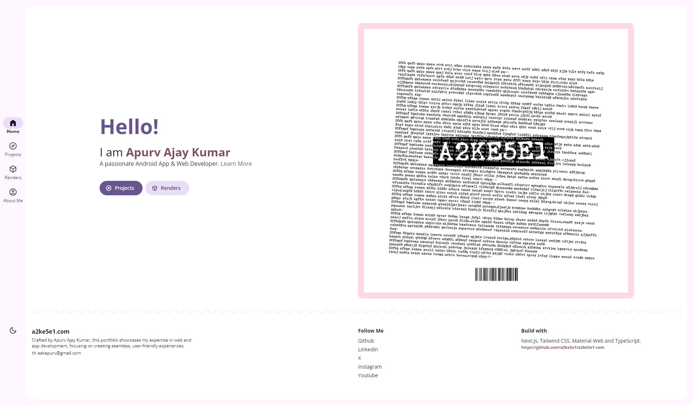

# [a2ke5e1.com](https://a2ke5e1.com)

This is a portfolio website built with [Next.js](https://nextjs.org/) and [Material Web Components](https://github.com/material-components/material-web).



## Getting Started

First, run the development server:

```bash
npm run dev
# or
yarn dev
```

Open [http://localhost:3000](http://localhost:3000) with your browser to see the result.
