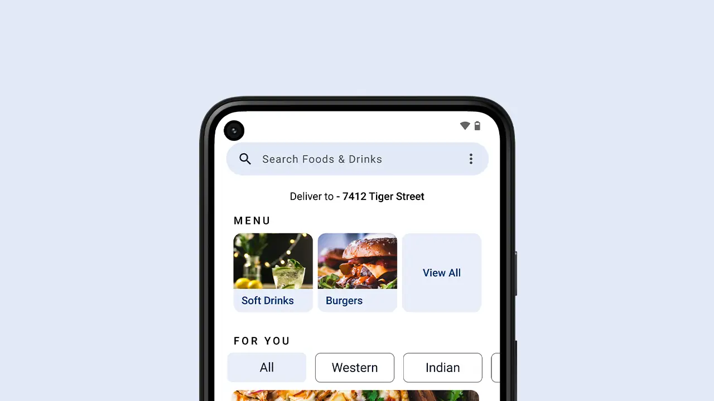
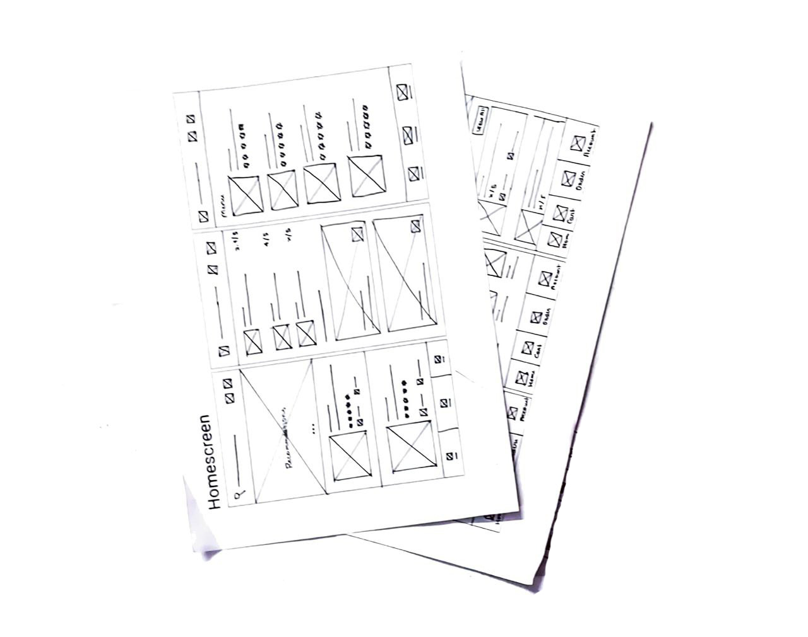
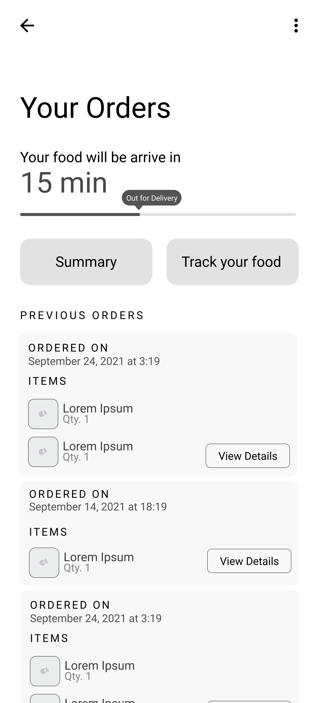
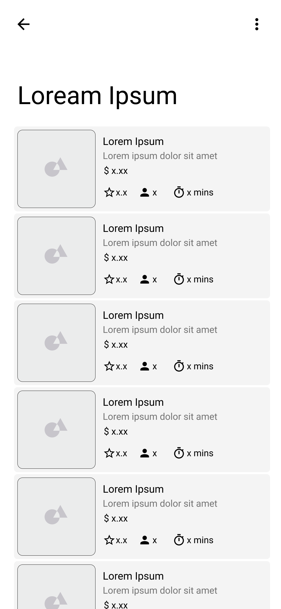
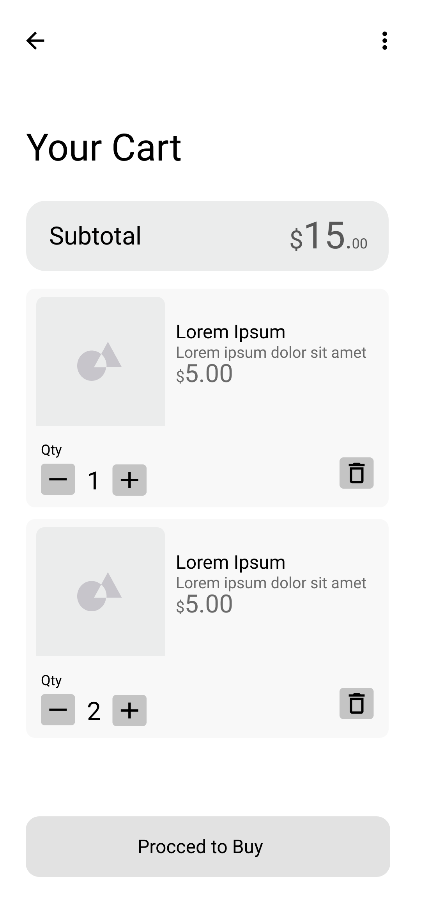

## My Role

I worked alone on this project, taking responsibility for the entire product experience. I was the lead UX designer and researcher throughout the project.

## Project Goal

Create a smooth experience from opening the app for the first time to ordering favorite food, without unnecessary friction or wasted time.

## Target Audience

The project targets people of all age groups, particularly those who are busy and don't have time to cook their own food.

## Key Challenges & Constraints

The main challenge was designing an experience that could work well for the next billion users, with a strong focus on simplicity, accessibility, and ease of use.

:::media
## Initial Design Concepts

I started with a quick ideation exercise to explore solutions for the gaps identified during the competitive audit.

My primary focus was:

* Making actions easy to discover and interact with
* Using appropriately sized interactive elements
* Minimizing the number of clicks required to complete common tasks
* Making the ordering flow simple and accessible

:::

## Wireframes

:::media

:::

## User Testing Results

### Round 1

Initial usability testing revealed several issues with the navigation and ordering flow:

* **3 out of 5 participants** found it difficult to find their orders from the home screen.
* **4 out of 5 participants** found it difficult to enter their address.
* **4 out of 5 participants** opened the cart screen instead of selecting their food.

These results highlighted problems with navigation hierarchy and the discoverability of important actions.

### Round 2

After iterating on the initial designs, the second round of testing revealed additional feature requirements:

* **5 out of 5 participants** wanted to filter food recommendations by type, such as Western or vegetarian.
* **4 out of 5 participants** wanted the ability to choose the size of their food.
* **4 out of 5 participants** wanted the option to choose from multiple saved addresses.

These findings helped shape the next iteration of the ordering experience.

## Mockups

:::iframe
https://www.figma.com/embed?embed_host=share&url=https://www.figma.com/file/WJ0W8g4n5uRZyh19wLX5xh/Foody?node-id=301%3A817
:::

:::iframe
https://www.figma.com/embed?embed_host=share&url=https://www.figma.com/proto/WJ0W8g4n5uRZyh19wLX5xh/Foody?node-id=307%3A498&scaling=scale-down&page-id=301%3A817&starting-point-node-id=307%3A498&show-proto-sidebar=1
:::

## Takeaways

Working on this project helped me understand the importance of accessibility and iterative design.

Usability studies and peer feedback played an important role in each iteration, helping identify friction points and improve the overall look, feel, and usability of the app.
