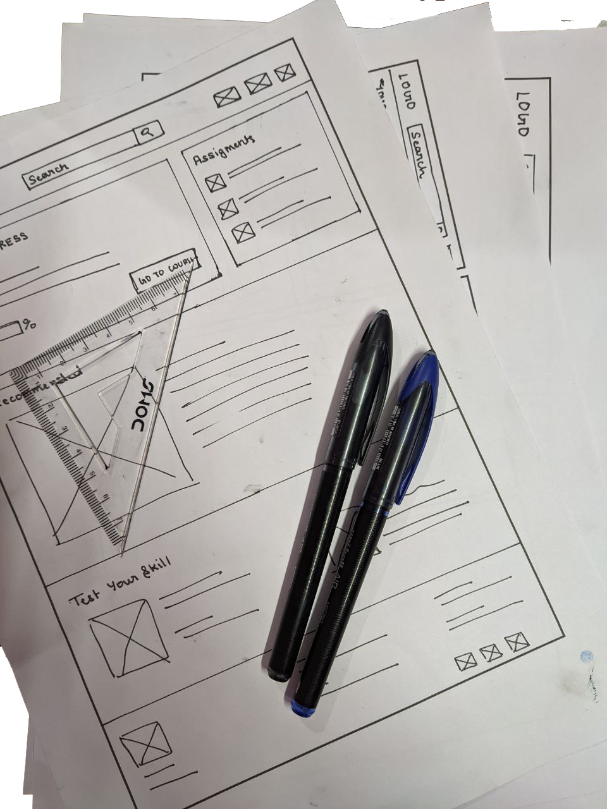
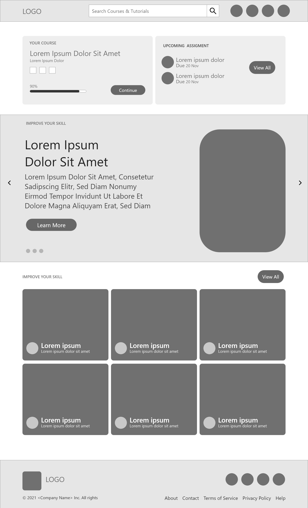
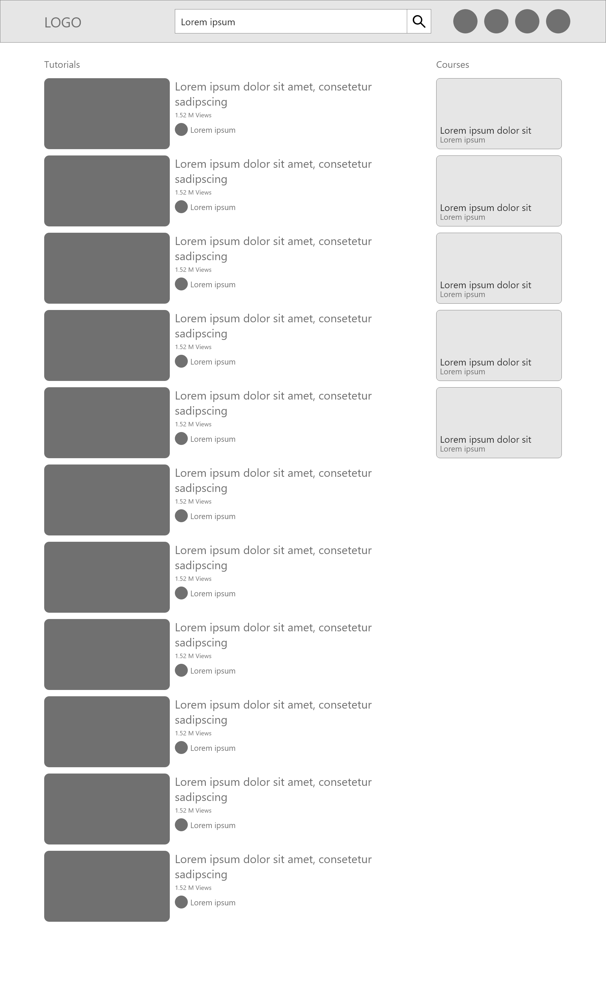
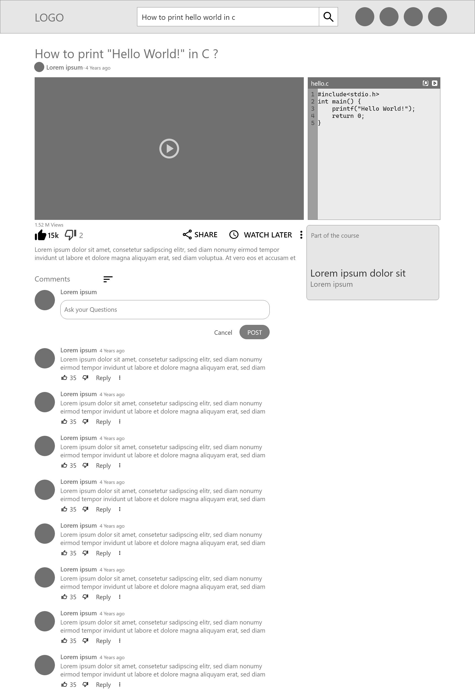

## My Role

I was working alone on this project, hence I was the lead UX Designer and Researcher throughout the whole project.

## Project Goal

Goal of project to provide high quality tutorials and to have a discussion for better understanding.

## Target Audience

This project aims to target people of all age groups, especially those who are learning programming.

## Key Challenges & Constraints

Key challenges were to provide a responsive design to mobile and web to find coding tutorials. This project aims to solve difficulties faced during learning programming.

:::media
## Initial Design Concepts

I did a quick ideation exercise to come up with ideas to address gaps identified in the competitive audit. My focus was especially on the size of the actions and minimizing clicks to complete a task.

:::

## Wireframes

:::media

:::

## User Testing Results

After User Testing, we found that people wanted a way to copy code from videos. So we added a sidebar to copy code presented in the video.

## Mockups

:::iframe

https://xd.adobe.com/embed/dc775c83-f017-4bc9-b330-ea90572f5820-8924/

:::

:::iframe

https://xd.adobe.com/embed/476470df-3c3b-4f26-9ab0-bdfd79775582-1237/

:::

## Takeaways

While working on this project, I have learned various skills and the importance of accessibility. Usability studies and peer feedback were instrumental in each iteration of the app's look and feel. I also increased my knowledge of using Adobe XD to create prototypes and learned to create responsive web design.