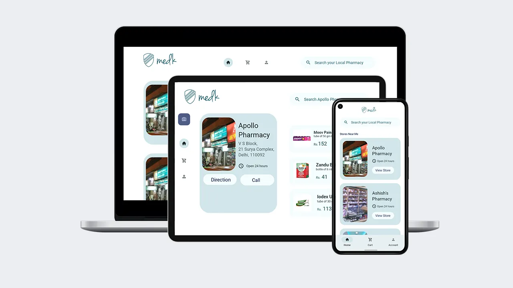
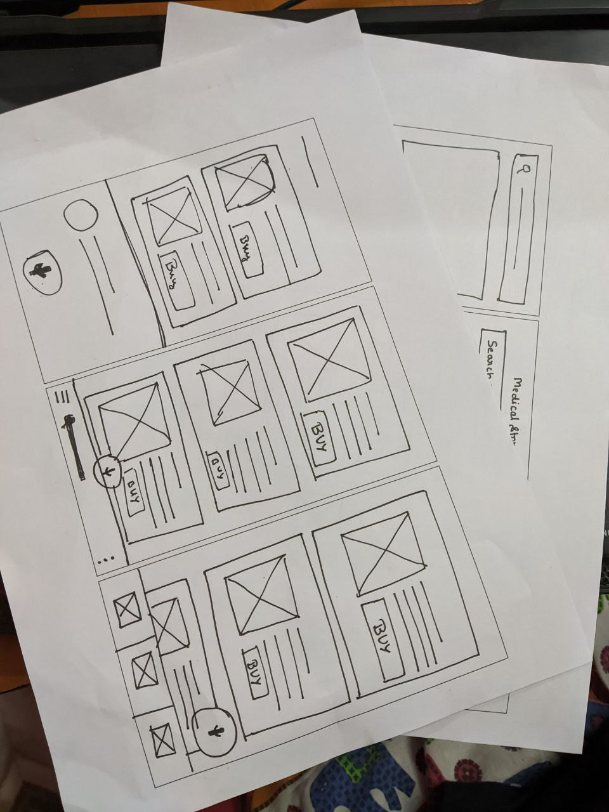
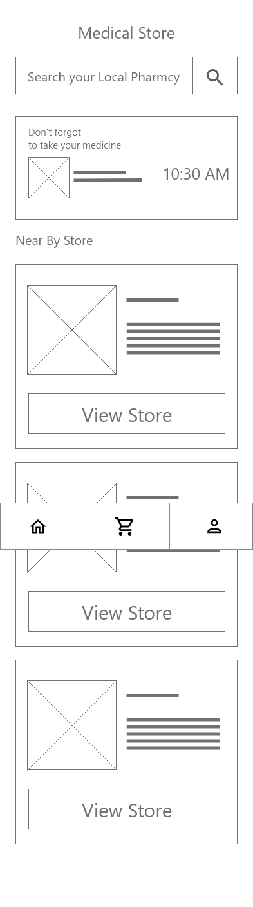
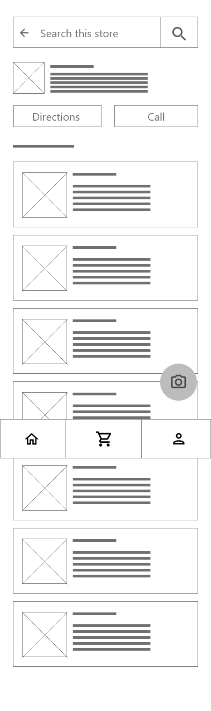
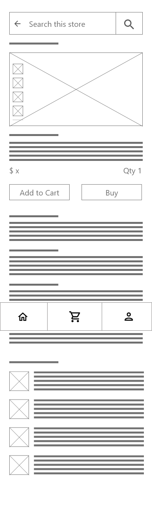

## My Role

I was working alone on this project, hence I was the lead UX Designer and Researcher throughout the whole project.

## Project Goal

This product aims to help people find their medicine in locality or order them online.

## Target Audience

This project aims to target elderly people. Especially people who have limited motor function.

## Key Challenges & Constraints

Key challenges were to provide a responsive design to mobile and web to find medicine. Many people need medicine that they can't find in their locality.

:::media

## Initial Design Concepts

I did a quick ideation exercise to come up with ideas for how to address gaps identified in the competitive audit. My focus was especially on the size of the actions and minimum clicks to complete a task.

:::

## Wireframes

:::media

:::

## User Testing Results

After a lot of user feedback and testing, I concluded it was easier to remove reminders and have bigger cards to see stores.

## Mockups

:::iframe

https://xd.adobe.com/embed/10c0dcb1-1ef9-4708-b20b-443772350c10-4593/

:::

## Takeaways

While doing this project I have increased my knowledge and experience on using Adobe XD to create prototypes for my upcoming project. I also learned to create responsive web design.

While working on this project I have learned various skills and the importance of accessibility. Usability studies and peer feedback was one of the most important factors in each iteration of the app's look and feel.

While doing this project I have increased my knowledge and experience on using Adobe XD to create prototypes for my upcoming project. I also learned to create responsive web design.