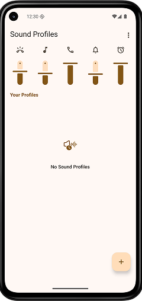
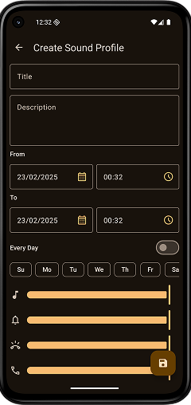
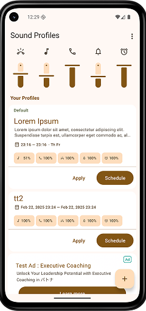

You can schedule your audio profiles by day, week, hour, or even minute, tailoring the volume levels for ringtones, alarms, and media to fit your lifestyle. Create multiple schedules for different days or events, and let the app automatically adjust your sound settings, ensuring your device's volume is always just right. Perfect for those who need a flexible solution to manage sound in various environments without manual adjustments.

:::media

:::

### Why does app require exact alarm permission?
App need to use the Schedule Exact Alarms permission to automatically change sound profiles. This is crucial for ensuring that sound profiles are changed at the specified
times without delay, even if the device is in Doze mode or has battery optimizations enabled. This permission ensures the reliability and accuracy of scheduled sound profile
changes.