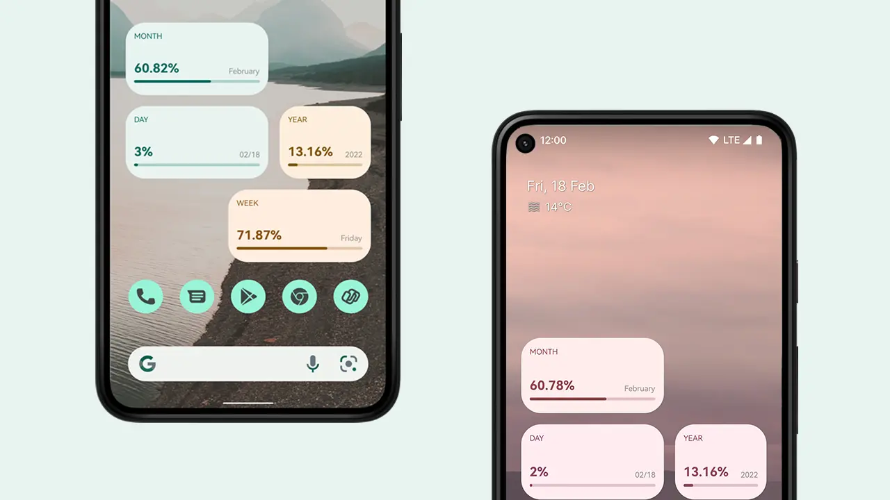

An Android application that visualizes how much of the day, month, and year has passed, helping users maintain awareness of their time.

The application has reached **10K+ downloads**, **3K+ monthly active users**, and a **4.4+ Play Store rating**.

:::media

## What I worked on

- Designed and developed the Android application.
- Built the application's UI and interaction model.
- Published and maintained the application on Google Play.
- Worked on performance, usability, and iterative [product improvements](/about).

:::